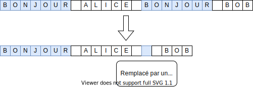
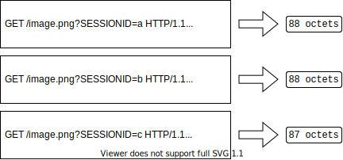
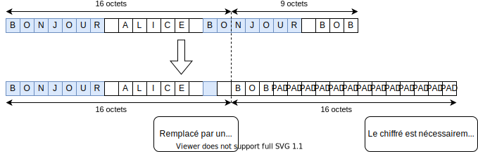

## Project setup update

0. Uninstall pyenv if it's old
1. Install pyenv (`curl https://pyenv.run | bash`)
2. Install python 3.10.1 (`pyenv install 3.10.1` and `pyenv global 3.10.1`)
3. Clone the repo and `cd` into it
4. Create a virtual env (`python -m venv env`)
5. Start a shell with the virtual env (`source env/bin/activate`)
6. Install dependencies (`python -m pip install -r requirements.txt`)
7. Test the exploits! (`python CRIME-cbc-poc.py`)

---

# CVE-2012-4929 alias CRIME

_Une attaque sur TLS/SSL_

Description officielle (traduite) :

> Les protocoles TLS 1.2 et antérieurs, tels qu'utilisés par Mozilla Firefox, Google Chrome, Qt, et d'autres produits, peuvent chiffrer des données compressées sans prendre le soin dissimuler la longueur des données en clair. Cela permet, par des attaques d'homme du milieu, d'obtenir les en-têtes HTTP en clair en observant les différences de longueur entre différentes requêtes dans lesquelles une chaîne de la requête est partiellement égale à la chaîne inconnue placée dans un en-tête HTTP. Cette attaque est aussi connue sous le nom de "CRIME".

## Principe

Le protocole TLS 1.2 propose d'utiliser un mécanisme de compression, DEFLATE, avant de chiffrer les données. Cet algorithme fonctionne en cherchant les motifs répétés, et en remplaçant les occurrences de ce motif par un jeton beaucoup plus court.

De la même façon, un attaquant peut observer si l'algorithme DEFLATE trouve un motif dans une requête HTTP qu'il ne maîtrise que partiellement, dans le but de deviner ce motif octet par octet, en observant uniquement la longueur du message compressé.

## Application

En pratique, cette attaque peut être utilisée pour deviner le contenu d'un cookie permettant de s'authentifier sur un site internet. Nous allons utiliser cet exemple ci-après afin d'explorer l'attaque plus en profondeur.

Prenons le cas de JavaScript. Pour réaliser l'attaque, il faut remplir 2 conditions :

- Pouvoir exécuter du JavaScript sur la machine de la victime ; par exemple la victime ouvre un site malveillant en cliquant sur une publicité
- Pouvoir écouter les requêtes envoyées par la victime ; par exemple en faisant de l'empoisonnement de cache ARP

En JavaScript, un attaquant peut envoyer une requête à n'importe quel site, mais ne peut contrôler qu'un seul en-tête de la requête, l'adresse de destination, les autres en-têtes étant gérés par le navigateur.

Par exemple, un attaquant essaie de deviner la valeur du cookie `SESSIONID` en envoyant des requêtes sur une image du site `www.banque.fr`. Après compression, ces requêtes deviennent :

On constate que le message est plus court d'un octet dans le dernier cas, et par conséquent, l'attaquant peut déduire que le secret commence par un `c`.

Cependant, l'attaque n'est pas aussi simple car le message est chiffré après avoir été compressé. Il y a deux chiffrements vulnérables : RC4 et AES-CBC.

### RC4
RC4 étant un chiffrement par flot, le message chiffré fait la longueur du message compressé. Ainsi, l'attaque est directe et se fait comme décrite au dessus.
### AES-CBC
Le cas de AES-CBC est plus complexe. En effet, le message chiffré a une taille qui est toujours un multiple de 16. Si on tente d'appliquer la méthode précédente naïvement, il y a fort à parier que la taille du message sera la même avant et après compression : le padding sera adapté de sorte à ce que la taille du message soit un multiple de 16.

Il y a cependant la possibilité d'utiliser la spécification de AES-CBC à notre avantage : Si le message à chiffrer est un multiple de 16 octets, un nouveau bloc complet sera ajouté en padding. Sinon, un padding (de longueur comprise entre 1 et 15 octets) sera ajouté pour obtenir un message de longueur un multiple de 16.

Ainsi si nous ajoutons des octets (peu importe la valeur de ces octets) de sorte à ce que le message complet soit un multiple de 16 (en prenant en compte notre prédiction) alors nous aurons un bloc complet de padding à la fin du message chiffré.

Nous pouvons maintenant utiliser le bruteforce sur l'octet attaqué et nous verrons bien une différence de taille si nous l'octet proposé est correct : si on devine le bon octet, il sera compressé et nous obtiendrons un chiffré d'une taille réduite de 16 (et un octet de padding aura été ajouté à la fin du message).

Nous pouvons maintenant continuer l'attaque jusqu'à déterminer tous les octets à déterminer en réitérant l'opération.

## Prévention

La prévention de l'attaque CRIME est plutôt simple : il suffit que le client (ou le serveur) indique qu'il ne souhaite pas faire de compression. Ainsi il devient impossible d'exploiter la compression pour déterminer certains octets du message.

## Preuve de Concept

Ici-même.

## Sources

- Martial Puygrenier : https://github.com/mpgn/CRIME-poc
- Thomas Pornin : https://security.stackexchange.com/questions/19911
